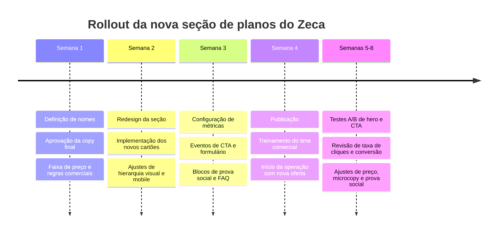

# Relatório de otimização da seção de planos do Zeca

## Sumário executivo

Arquivos para download: [PDF](sandbox:/mnt/data/zeca-planos-recomendacao-pt.pdf) · [DOCX](sandbox:/mnt/data/zeca-planos-recomendacao-pt.docx) · [HTML](sandbox:/mnt/data/zeca-planos-recomendacao-pt.html) · [Markdown](sandbox:/mnt/data/zeca-planos-recomendacao-pt.md)

A seção atual de planos do Zeca tem uma base estrutural aproveitável: comparação curta entre duas opções, destaque visual para o plano pago e uma tentativa legítima de explicar que a recomendação depende de aderência, não apenas de pagamento. O que está reduzindo a força comercial da página não é a estrutura em si, e sim a linguagem. Hoje a copy fala mais sobre o mecanismo interno da oferta do que sobre o ganho prático para empresas e profissionais. Em termos de percepção, o visitante encontra “cadastro”, “prioridade”, “consultor” e “financeiro” antes de encontrar “visibilidade”, “clientes”, “oportunidades” e “receita”.

Minha recomendação central é reposicionar a seção com foco explícito em resultado, usando dois nomes muito claros para os planos: **Presença** no gratuito e **Destaque** no pago. Essa dupla organiza a progressão mental da oferta com muito mais naturalidade: primeiro o negócio entra e passa a existir no ecossistema; depois ganha exposição ampliada onde houver aderência real. Junto com essa troca, a página deve abandonar “Sob consulta” como mensagem principal e substituir o CTA burocrático por um CTA de crescimento. O eixo recomendado passa a ser: **mais visibilidade, mais oportunidades, mais chance de ser encontrado no momento certo**.

As referências oficiais usadas como benchmark de estrutura reforçam exatamente esse caminho: a Stripe recomenda que landing pages sejam escritas a partir da jornada do cliente, não da história da empresa; HubSpot e Slack usam nomes simples de planos, preço de entrada visível e CTAs diretos como “Get started” e “Talk to sales”; HubSpot também posiciona sinais de ROI perto da decisão de pricing, enquanto Slack usa logos e prova de confiança antes ou junto da comparação dos planos. citeturn5view0turn5view1turn5view2

Se você quiser priorizar apenas uma mudança imediata antes de redesenhar tudo, eu faria esta combinação: **novo título focado em resultado + troca do nome do plano pago para Destaque + CTA “Quero mais visibilidade”**. Sozinha, essa mudança já deve melhorar a compreensão da oferta e a intenção de clique.

## Diagnóstico da seção atual

A seção atual acerta ao manter a decisão simples. Duas opções são suficientes para esta etapa do produto. Isso reduz fricção cognitiva e facilita a leitura. O problema está no fato de que a hierarquia verbal não acompanha a intenção do comprador.

O título **“Veja como se tornar um parceiro premium”** é fraco porque fala do status do parceiro, não do benefício que ele busca. O visitante comercial não quer “se tornar premium”; ele quer aparecer mais, ser lembrado, receber contatos mais qualificados e transformar presença em negócio. O subtítulo também está mais próximo de um anúncio institucional do que de uma proposta de valor.

Os nomes dos planos também travam a venda. **“Parceiro Base”** é funcional, mas pouco desejável. **“Parceiro Prioridade”** é abstrato. “Prioridade” parece fila preferencial. “Destaque”, por outro lado, comunica imediatamente um efeito visível e desejável na plataforma. Ele traduz com mais força o que o comprador espera receber.

O preço do plano pago, apresentado como **“Sob consulta”**, aumenta atrito logo no momento mais sensível da decisão. Se o comercial precisa de flexibilidade por categoria ou região, isso pode ser preservado internamente; mas, na interface, é melhor ancorar expectativa com um valor inicial claro. Em contraste, as páginas oficiais de HubSpot e Slack mostram preço de entrada imediatamente, com “Starts at” visível, o que ajuda o visitante a filtrar fit sem assumir que a solução será cara demais. citeturn5view1turn5view2

Os CTAs atuais também enfraquecem a conversão. **“Fale com nosso financeiro”** enquadra o ato de comprar como negociação burocrática. **“Fale com nosso consultor”** no plano gratuito cria atrito onde seria melhor oferecer entrada quase instantânea. Em referências oficiais, o padrão é outro: CTA objetivo, de ação, com linguagem que conduz o próximo passo de forma natural. Stripe reforça a importância de copy centrada no visitante; Slack e HubSpot usam CTAs curtos e diretos, sem departamentos internos no centro da decisão. citeturn5view0turn5view1turn5view2

Por fim, a lista de recursos do plano pago ainda está muito “de dentro para fora”. Há ativos bons ali — prioridade, cupons, banners, integrações, comunicação com usuários — mas eles estão descritos como mecanismos, não como ganhos. Em marketing, a pergunta oculta do leitor sempre é a mesma: **“o que isso muda para mim?”**. A copy precisa responder essa pergunta em cada bullet.

## Nomenclatura e arquitetura de planos

A melhor opção única para o Zeca é esta:

| Papel do plano | Nome recomendado | Por que funciona melhor |
|---|---|---|
| Gratuito | **Presença** | Comunica entrada, existência, visibilidade inicial e construção de reputação |
| Pago | **Destaque** | Comunica aumento de exposição, ganho perceptível e intenção comercial clara |

Essa é a melhor dupla por quatro motivos. Primeiro, é entendida em segundos por empresas e profissionais de qualquer segmento. Segundo, traduz uma progressão muito natural: **entrar** e depois **aparecer com mais força**. Terceiro, evita jargões genéricos como “Premium”, “Priority” ou “Pro”, que funcionam em software horizontal, mas dizem menos sobre o ganho concreto do Zeca. Quarto, conecta diretamente com os resultados que mais importam aqui: **ser encontrado, ter mais visibilidade e gerar oportunidades**.

Se a marca quiser manter a palavra “Parceiro”, a derivação mais forte seria **Parceiro Presença** e **Parceiro Destaque**. Ainda assim, para a interface, eu recomendo usar apenas **Presença** e **Destaque**, porque a leitura fica mais rápida e o espaço visual dos cards fica mais limpo.

A arquitetura de preço sugerida é esta:

| Plano | Como exibir no site | Observação comercial |
|---|---|---|
| Presença | **Grátis** | Entrada sem atrito |
| Destaque | **A partir de R$ 197/mês*** | Faixa interna sugerida entre **R$ 197 e R$ 497/mês**, conforme categoria, região e disponibilidade |

O ponto principal não é “acertar o número perfeito” na primeira versão. O ponto principal é **não esconder a âncora de preço**. O visitante precisa entender rapidamente se a oferta está próxima do seu orçamento. A mensagem “A partir de R$ 197/mês” resolve isso melhor do que “Sob consulta”, e o asterisco pode preservar a flexibilidade comercial com uma observação curta no rodapé.

O posicionamento recomendado é simples. **Presença** vende entrada, reputação inicial e elegibilidade para recomendações. **Destaque** vende aceleração dessa presença: mais exposição, melhor posicionamento, mais chance de entrar no radar do cliente certo e mais oportunidades de negócio. O Zeca deve prometer **visibilidade qualificada**, não garantia de lead ou faturamento. Isso deixa a oferta forte sem perder credibilidade.

## Copy final pronta para publicação

**Hero recomendado**

**Eyebrow**  
PLANOS PARA EMPRESAS E PROFISSIONAIS

**Título**  
**Receba mais visibilidade e conquiste clientes certos com o Zeca**

**Subtítulo**  
Cadastre seu negócio gratuitamente ou amplie sua presença com destaque nas recomendações. O Zeca conecta empresas e profissionais a usuários com intenção real, no contexto certo.

**CTA principal**  
**Quero mais visibilidade**

**CTA secundário**  
**Criar perfil gratuito**

**Microcopy abaixo dos CTAs**  
Disponibilidade limitada no plano Destaque por categoria e região.

**Plano Presença**

**Badge opcional**  
Entrada gratuita

**Nome**  
**Presença**

**Preço**  
**Grátis**

**Descrição curta**  
Para empresas e profissionais que querem entrar no Zeca, construir reputação e começar a receber visibilidade qualificada.

**Benefícios reescritos como valor**
- Coloque seu negócio na base de recomendações do Zeca.
- Apareça na categoria e na região mais relevantes para o seu serviço.
- Passe por uma avaliação inicial para aumentar confiança no seu perfil.
- Seja recomendado quando houver compatibilidade real com a necessidade do usuário.
- Comece a construir histórico e presença dentro da plataforma.

**CTA do card**  
**Criar perfil gratuito**

**Microcopy do CTA**  
Sem custo para começar.

**Plano Destaque**

**Badge recomendado**  
Mais visibilidade

**Nome**  
**Destaque**

**Preço sugerido para exibição**  
**A partir de R$ 197/mês***

**Descrição curta**  
Para quem quer ampliar exposição, gerar mais oportunidades e ocupar posições mais estratégicas nas recomendações do Zeca.

**Benefícios reescritos como valor**
- Tudo do plano Presença.
- Ganhe prioridade nas recomendações quando houver aderência real com a busca do usuário.
- Receba destaque visual em categorias e espaços estratégicos da plataforma.
- Ative cupons, descontos e cashback para aumentar conversão e estimular novas compras.
- Tenha acesso a ações promocionais, integrações e oportunidades exclusivas do ecossistema Zeca.
- Abra um canal mais direto de contato com usuários quando fizer sentido para a jornada.
- Entre antes em novos formatos, recursos e iniciativas comerciais.
- Conte com atendimento prioritário para ativação, ajustes e acompanhamento.

**CTA do card**  
**Quero mais visibilidade**

**Microcopy do CTA**  
Analisamos categoria e região em até 1 dia útil.

**Tabela comparativa recomendada**

| Recurso ou benefício | Presença | Destaque |
|---|---:|---:|
| Perfil da empresa ou profissional no Zeca | Sim | Sim |
| Avaliação inicial do perfil | Sim | Sim |
| Presença em categoria e região | Sim | Sim |
| Recomendação quando houver compatibilidade | Sim | Sim |
| Construção de histórico dentro da plataforma | Sim | Sim |
| Prioridade nas recomendações | — | Sim |
| Destaque visual em espaços estratégicos | — | Sim |
| Cupons, descontos e cashback | — | Sim |
| Ações promocionais exclusivas | — | Sim |
| Canal de contato mais direto com usuários | — | Sim |
| Integrações e formatos especiais | — | Sim |
| Atendimento prioritário | — | Sim |

**Prova social recomendada**

Os números abaixo devem entrar **apenas quando forem reais e verificáveis**. Enquanto isso, use os placeholders como estrutura.

**Estatísticas curtas**
- **+[X]** empresas e profissionais já cadastrados
- **+[X]** categorias atendidas
- **[X]%** das recomendações consideram categoria, região e contexto da busca

**Depoimentos curtos**
- “Começamos a receber contatos muito mais alinhados com o que realmente oferecemos.” — **[Nome]**, **[Empresa]**, **[Cidade]**
- “O Zeca aumentou nossa visibilidade sem depender só de anúncio.” — **[Nome]**, **[Empresa]**
- “Entramos para ser encontrados. Ficamos porque começamos a ganhar oportunidades reais.” — **[Nome]**, **[Empresa]**

**Texto de urgência e escassez**

**Versão principal**  
As vagas do plano Destaque são limitadas por categoria e região para preservar a qualidade das recomendações. Se houver disponibilidade no seu segmento, sua ativação pode começar imediatamente.

**Versão curta para perto do CTA**  
Disponibilidade limitada no seu segmento.

**Explicação mais forte de como as recomendações funcionam**

**Título da seção**  
**Como o Zeca decide quem aparece primeiro**

**Texto recomendado**  
O Zeca não recomenda apenas quem paga mais. A ordem das recomendações considera a compatibilidade entre a necessidade do usuário, a categoria, a região, a qualidade do perfil e o histórico do parceiro. O plano Destaque aumenta sua exposição quando existe aderência real com a busca, ajudando sua empresa a aparecer mais sem comprometer a confiança da recomendação.

**Microcopy de botões e apoio**
- Criar perfil gratuito
- Quero mais visibilidade
- Solicitar análise do meu segmento
- Ver comparação completa
- Falar com um especialista
- Sem custo para começar.
- Leva poucos minutos.
- Analisamos sua categoria e região em até 1 dia útil.
- Sem compromisso na primeira conversa.

**Footnote e observação**
- *O valor do plano Destaque é uma sugestão inicial e pode variar conforme categoria, cidade e disponibilidade comercial.*
- *Parceiros do plano Destaque ganham mais exposição, mas a recomendação final continua baseada em aderência real, contexto da busca e confiança construída na plataforma.*

**Variantes A/B para hero e CTA**

| Variante | Título | Subtítulo | CTA principal | CTA secundário |
|---|---|---|---|---|
| A | **Transforme buscas em oportunidades de negócio** | Entre gratuitamente no Zeca ou ative o plano Destaque para aumentar sua visibilidade nas recomendações e atrair clientes com intenção real. | **Garantir meu destaque** | **Entrar gratuitamente** |
| B | **Seja encontrado por quem já está procurando o que você oferece** | Cadastre seu negócio sem custo e, quando estiver pronto para crescer, ganhe destaque em categoria, região e recomendações com o Zeca. | **Quero aparecer primeiro** | **Cadastrar meu negócio** |

**Snippet HTML do hero**

```html
<section class="zeca-pricing-hero" id="planos">
  <p class="eyebrow">PLANOS PARA EMPRESAS E PROFISSIONAIS</p>
  <h2>Receba mais visibilidade e conquiste clientes certos com o Zeca</h2>
  <p class="subtitle">
    Cadastre seu negócio gratuitamente ou amplie sua presença com destaque nas recomendações.
    O Zeca conecta empresas e profissionais a usuários com intenção real, no contexto certo.
  </p>

  <div class="hero-actions">
    <a href="#plano-destaque" class="btn btn-primary">Quero mais visibilidade</a>
    <a href="#plano-presenca" class="btn btn-secondary">Criar perfil gratuito</a>
  </div>

  <p class="hero-microcopy">
    Disponibilidade limitada no plano Destaque por categoria e região.
  </p>
</section>
```

**Snippet HTML dos cards**

```html
<section class="zeca-plan-cards">
  <article class="plan-card plan-card--secondary" id="plano-presenca">
    <span class="plan-badge">Entrada gratuita</span>
    <h3>Presença</h3>
    <p class="plan-description">
      Para empresas e profissionais que querem entrar no Zeca, construir reputação
      e começar a receber visibilidade qualificada.
    </p>
    <p class="plan-price">Grátis</p>

    <ul class="plan-features">
      <li>Coloque seu negócio na base de recomendações do Zeca.</li>
      <li>Apareça na categoria e na região mais relevantes para o seu serviço.</li>
      <li>Passe por uma avaliação inicial para aumentar confiança no seu perfil.</li>
      <li>Seja recomendado quando houver compatibilidade real com a necessidade do usuário.</li>
      <li>Comece a construir histórico e presença dentro da plataforma.</li>
    </ul>

    <a href="/cadastro" class="btn btn-outline">Criar perfil gratuito</a>
    <p class="plan-microcopy">Sem custo para começar.</p>
  </article>

  <article class="plan-card plan-card--featured" id="plano-destaque">
    <span class="plan-badge">Mais visibilidade</span>
    <h3>Destaque</h3>
    <p class="plan-description">
      Para quem quer ampliar exposição, gerar mais oportunidades e ocupar posições
      mais estratégicas nas recomendações do Zeca.
    </p>
    <p class="plan-price">A partir de R$ 197/mês<span>*</span></p>

    <ul class="plan-features">
      <li>Tudo do plano Presença.</li>
      <li>Ganhe prioridade nas recomendações quando houver aderência real com a busca do usuário.</li>
      <li>Receba destaque visual em categorias e espaços estratégicos da plataforma.</li>
      <li>Ative cupons, descontos e cashback para aumentar conversão e estimular novas compras.</li>
      <li>Tenha acesso a ações promocionais, integrações e oportunidades exclusivas do ecossistema Zeca.</li>
      <li>Abra um canal mais direto de contato com usuários quando fizer sentido para a jornada.</li>
      <li>Entre antes em novos formatos, recursos e iniciativas comerciais.</li>
      <li>Conte com atendimento prioritário para ativação, ajustes e acompanhamento.</li>
    </ul>

    <a href="/parceria-destaque" class="btn btn-primary">Quero mais visibilidade</a>
    <p class="plan-microcopy">Analisamos categoria e região em até 1 dia útil.</p>
  </article>
</section>
```

## Layout e hierarquia visual recomendados

A seção deve conduzir a decisão em uma ordem muito clara: **proposta de valor, escolha do plano, validação racional, prova de confiança e call to action**. Em termos práticos, a melhor sequência é esta: eyebrow, título, subtítulo, dois botões, cards dos planos, faixa curta com estatísticas ou logos, tabela comparativa, depoimento curto, explicação de como as recomendações funcionam e observações finais.

O card **Destaque** deve parecer objetivamente mais valioso sem perder elegância. Eu recomendo mantê-lo como card principal, com borda mais forte, leve sombra, badge curto no topo, preço maior e CTA visualmente dominante. No mobile, o **Destaque** deve aparecer primeiro. O **Presença** continua importante, mas como rota de entrada.

O preço precisa subir na hierarquia visual. “Grátis” e “A partir de R$ 197/mês” devem aparecer acima da lista de benefícios, em tamanho maior e com pouco ruído em volta. Se houver variação por região ou categoria, isso entra apenas no asterisco e no rodapé. Não deve ocupar o lugar da mensagem principal.

A lista visível de benefícios deve priorizar entre cinco e sete itens por card. Mais do que isso começa a parecer inventário, não valor. Se o Zeca quiser manter uma lista completa, vale usar “Ver tudo que está incluso” em expansão abaixo do card ou dentro do comparativo.

Os ícones recomendados são estes:

| Tema | Ícone sugerido | Aplicação |
|---|---|---|
| Perfil validado | badge-check ou check-circle | Avaliação inicial e confiança |
| Categoria e região | map-pin | Presença contextual |
| Recomendação inteligente | sparkles ou target | Compatibilidade com a busca |
| Mais visibilidade | star ou megaphone | Destaque do plano pago |
| Incentivo comercial | ticket ou gift | Cupons, descontos e cashback |
| Contato | message-square | Comunicação com usuários |
| Confiança | shield-check | Explicação do algoritmo |
| Prioridade | clock ou headset | Atendimento prioritário |

Minha recomendação é usar uma família única de ícones outline, com o mesmo peso visual e entre 18 px e 20 px. Misturar estilos ou cores muito diferentes reduz sensação de sistema.

Sobre prova social, a regra prática é esta: **estatísticas curtas logo abaixo dos cards; depoimento curto entre a comparação e a explicação do algoritmo**. Isso é uma inferência consistente com a forma como HubSpot aproxima métricas de ROI da seção de pricing e como Slack usa sinais de confiança e logos perto da escolha do plano. citeturn5view1turn5view2

## Precificação, onboarding e rollout

A lógica comercial recomendada para o plano pago não é “vender um banner” ou “vender prioridade” em abstrato. É vender **mais chance de ser visto por quem já tem intenção**. Por isso, a narrativa de ROI deve ser simples e honesta: **se o plano Destaque gerar 1 novo cliente por mês, em muitas categorias ele já pode se pagar**. Essa frase funciona bem em vendas porque traduz o investimento em raciocínio prático. Ela deve ser usada como argumento comercial, não como promessa pública de resultado.

A faixa sugerida para começar é esta:

| Faixa | Perfil comercial sugerido | Valor sugerido |
|---|---|---:|
| Entrada | Profissionais e pequenos negócios locais | R$ 197/mês |
| Intermediária | Pequenas empresas com concorrência moderada | R$ 297/mês |
| Premium | Categorias mais valiosas ou regiões mais disputadas | R$ 497/mês |

Na página pública, eu manteria apenas uma âncora: **A partir de R$ 197/mês**. A segmentação mais fina deve acontecer depois da manifestação de interesse.

O fluxo recomendado de onboarding é híbrido: **self-serve no plano gratuito e assistido no plano pago**. Isso reduz atrito na entrada e aumenta taxa de fechamento onde há ticket e percepção de valor mais altos.

| Etapa | Objetivo | Responsável | SLA sugerido |
|---|---|---|---|
| Escolha do plano | Capturar intenção e reduzir atrito | Site | Imediato |
| Cadastro inicial | Receber segmento, cidade, contato e categoria | Usuário | 2 a 3 minutos |
| Qualificação | Verificar aderência e disponibilidade por região | Comercial | Até 1 dia útil |
| Ativação do perfil | Revisar texto, categoria e posicionamento | CS e Operações | 1 a 2 dias úteis |
| Ativação do Destaque | Confirmar investimento e publicar benefícios pagos | Comercial e Operações | 1 a 2 dias úteis |
| Revisão de 30 dias | Avaliar visibilidade, aderência e ajustes | Comercial e CS | 30 dias |

A tabela de rollout recomendada para colocar a nova seção no ar é esta:

| Fase | Janela | Entrega principal |
|---|---|---|
| Definição de oferta | Semana 1 | Aprovar nomes, preço âncora, copy e lógica comercial |
| Design da seção | Semana 2 | Atualizar hierarquia visual, cards, badges, CTAs e comparação |
| Instrumentação | Semana 3 | Eventos de clique, envio de formulário, origem do lead e taxa de upgrade |
| Lançamento | Semana 4 | Colocar nova seção no ar e treinar time comercial |
| Otimização | Semanas 5 a 8 | Testar hero, CTA, prova social e preço âncora |

O cronograma em Mermaid pode ir direto para documentação interna ou handoff de produto:



As fontes oficiais usadas apenas como referência estrutural para este diagnóstico foram: **Stripe Atlas – Writing copy for landing pages**, **HubSpot – Sales Hub Pricing** e **Slack – Pricing Plans**. Elas sustentam a recomendação de copy centrada no cliente, nomes simples, preço de entrada visível, CTAs diretos e prova social próxima da decisão. citeturn5view0turn5view1turn5view2